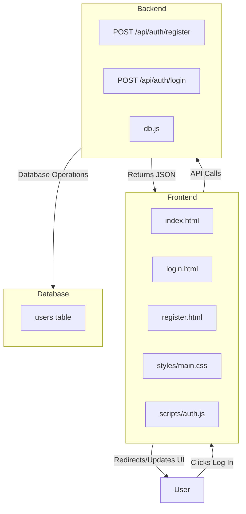

# DecentraForce Authentication System Plan

## Overview
This plan outlines the implementation of a login/registration system for the DecentraForce Web3 education platform, with Vercel hosting and database integration.

## Current State
- Single `index.html` file with inline CSS/JS
- Static website for Web3 education platform
- "Log In" button currently non-functional
- No backend or database

## Requirements
1. When "Log In" is pressed, redirect to login page
2. Create account option with email registration
3. Email must be typed twice for confirmation
4. Store user data in database on Vercel
5. Host entire application on Vercel

## System Architecture



## Detailed Implementation Plan

### 1. Frontend Development
- **Extract CSS** from inline to `styles/main.css`
- **Create `login.html`** with email input form
- **Create `register.html`** with dual email confirmation fields
- **Update navigation** in `index.html` to link to login page
- **Add form validation** JavaScript
- **Implement API integration** using Fetch API

### 2. Backend API Development
- **Create `/api/auth/register`** endpoint:
  - Validate email format
  - Check email uniqueness
  - Store in database
  - Return success/error response
- **Create `/api/auth/login`** endpoint:
  - Check if email exists
  - Return authentication status
- **Database connection** using `@vercel/postgres`

### 3. Database Schema
```sql
CREATE TABLE IF NOT EXISTS users (
  id SERIAL PRIMARY KEY,
  email VARCHAR(255) UNIQUE NOT NULL,
  created_at TIMESTAMP DEFAULT CURRENT_TIMESTAMP,
  verified BOOLEAN DEFAULT FALSE
);
```

### 4. Vercel Configuration
- **Set up Vercel Postgres** database
- **Configure environment variables**
- **Create `vercel.json`** for routing
- **Create `package.json`** with dependencies
- **Deploy via Vercel CLI/Git**

## Project Structure
```
/
├── index.html
├── login.html
├── register.html
├── styles/
│   └── main.css
├── scripts/
│   └── auth.js
├── api/
│   ├── auth/
│   │   ├── register.js
│   │   └── login.js
│   └── db.js
├── vercel.json
├── package.json
└── README.md
```

## Files to Create

### Frontend Files:
1. `styles/main.css` - Extracted CSS from current inline styles
2. `login.html` - Login page with email form
3. `register.html` - Registration page with email confirmation
4. `scripts/auth.js` - Form validation and API calls

### Backend Files:
1. `api/db.js` - Database connection helper
2. `api/auth/register.js` - Registration endpoint
3. `api/auth/login.js` - Login endpoint

### Configuration Files:
1. `vercel.json` - Vercel configuration
2. `package.json` - Dependencies and scripts
3. `.env.local` - Local environment variables (template)

## Testing Plan
1. **Frontend Testing**: Form validation, navigation, responsive design
2. **API Testing**: Endpoint functionality, error handling
3. **Integration Testing**: Complete registration/login flow
4. **Deployment Testing**: Vercel deployment, database connectivity

## Deployment Steps
1. Initialize Git repository
2. Install Vercel CLI and login
3. Create Vercel Postgres database
4. Set environment variables
5. Deploy to Vercel
6. Test production deployment

## Security Considerations
- Email validation on client and server
- Rate limiting on API endpoints
- HTTPS enforcement
- Input sanitization
- Database connection pooling

## Future Enhancements
1. Password-based authentication
2. Email verification system
3. Password reset functionality
4. Social login (Google, GitHub)
5. User profiles and dashboard
6. Session management with JWT

## Estimated Effort
- Frontend: 2-3 hours
- Backend: 2-3 hours  
- Database setup: 1 hour
- Testing & deployment: 1-2 hours
- **Total: 6-9 hours**

## Next Steps
1. Review and approve this plan
2. Switch to Code mode for implementation
3. Implement frontend pages first
4. Set up backend API and database
5. Test and deploy to Vercel