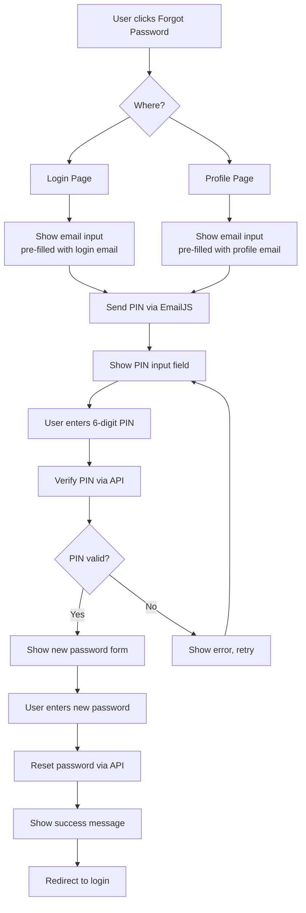

# My Courses Page Improvements Plan

## Overview
This document outlines the planned improvements for the `my-courses.html` page based on user requirements.

## Requirements Analysis

### 1. Fix Overlapping Issue
**Problem**: The sidebar "DecentraForce" logo overlaps with the "Home" breadcrumb in the topbar on desktop.
**Root Cause**: The sidebar has `z-index: 50` and topbar has `z-index: 40`, causing the sidebar to appear on top. Also, there may be margin/positioning issues.
**Solution**: 
- Increase topbar's z-index to be higher than sidebar (e.g., `z-index: 60`)
- Ensure proper margin-left calculation for the topbar within `.main` container
- Add responsive adjustments for mobile view

### 2. Rename Course Categories
**Changes Required**:
1. "NanoDegree Courses" → "Ongoing Courses"
   - Tab button text (line 586)
   - Sidebar navigation item (line 527)
   - Section label (line 593)
   - Keep internal ID as `'nanodegree'` for JavaScript functionality
   - Consider updating badge text from "NanoDegree" to "Ongoing" (optional)

2. "Subscription Courses" → "Purchased Courses"
   - Tab button text (line 587)
   - Sidebar navigation item (line 531)
   - Section label (line 658)
   - Keep internal ID as `'subscription'` for JavaScript functionality
   - Update badge text from "Subscription" to "Purchased"

### 3. Enhanced Profile Panel
**Current State**: Basic profile display with avatar, name, ID, stats, and motivational text.
**Required Enhancements**:

#### 3.1 Display Account Creation Date
- Add `created_at` field display
- Format as "Member since [Month] [Year]" or similar
- Fetch from user data via `/api/auth/verify` endpoint

#### 3.2 Editable Profile Fields
- **Name/Username**: Editable field with validation
- **Email**: Editable with verification
- **Password**: Change password functionality
- **Save/Cancel** buttons

#### 3.3 Profile Editing UI Design
```
[Profile Avatar]
[Display Name] (editable)
[Email] (editable)
[Member since: Jan 2025]

[Change Password Section]
- Current Password
- New Password
- Confirm New Password

[Save Changes] [Cancel]
```

#### 3.4 Integration with Backend
- New API endpoint `/api/auth/update-profile` (or extend existing)
- Handle username/email uniqueness validation
- Password change requires current password verification

### 4. Forgot Password Flow Enhancement
**Current Implementation**: 
- Forgot password link exists in login.html
- Sends PIN via EmailJS (already implemented in `/api/auth/forgot-password`)
- PIN verification and password reset API exists (`/api/auth/reset-password`)

**Required Improvements**:

#### 4.1 Add Forgot Password to Profile Page
- Add "Change Password" / "Forgot Password" link in profile panel
- Modal or inline form for password reset

#### 4.2 Complete PIN Verification Flow
**Current Gap**: Login page only shows "PIN sent" alert but no PIN entry UI.
**Solution**: Implement modal or separate page for:
1. Enter email → Send PIN
2. Enter PIN → Verify
3. Enter new password → Reset

#### 4.3 PIN Verification UI Options:
**Option A**: Modal dialog
```
[Forgot Password?] click
↓
Modal: Enter your email
↓
Modal: Check your email, enter 6-digit PIN
↓
Modal: Enter new password
↓
Success message
```

**Option B**: Dedicated page `reset-password.html`
- Linked from login and profile pages
- Multi-step form

### 5. Technical Implementation Details

#### 5.1 CSS Fixes for Overlapping
```css
/* Increase topbar z-index */
.topbar {
  z-index: 60; /* Was 40 */
}

/* Ensure sidebar doesn't overlap */
.sidebar {
  z-index: 50; /* Keep as is */
}

/* Mobile adjustments */
@media (max-width: 768px) {
  .topbar {
    padding-left: 16px; /* Adjust for hidden sidebar */
  }
}
```

#### 5.2 Profile Panel HTML Structure
```html
<div class="profile-panel">
  <div class="profile-avatar">DF</div>
  <div class="profile-name editable" data-field="username">Web3 Learner</div>
  <div class="profile-email editable" data-field="email">user@example.com</div>
  <div class="profile-meta">Member since: January 2025</div>
  
  <div class="profile-stats">...</div>
  
  <!-- Edit Profile Form -->
  <div class="edit-profile-form" style="display: none;">
    <input type="text" id="edit-username" value="Web3 Learner">
    <input type="email" id="edit-email" value="user@example.com">
    <button class="save-btn">Save Changes</button>
    <button class="cancel-btn">Cancel</button>
  </div>
  
  <!-- Change Password Section -->
  <div class="change-password-section">
    <h4>Change Password</h4>
    <input type="password" id="current-password" placeholder="Current password">
    <input type="password" id="new-password" placeholder="New password">
    <input type="password" id="confirm-password" placeholder="Confirm new password">
    <button class="change-password-btn">Update Password</button>
    <a href="#" class="forgot-password-link">Forgot Password?</a>
  </div>
</div>
```

#### 5.3 Forgot Password Modal
```javascript
// Modal for PIN verification
function showForgotPasswordModal(email = '') {
  // Create modal with:
  // 1. Email input (pre-filled if provided)
  // 2. "Send PIN" button
  // 3. PIN input field (appears after sending)
  // 4. New password fields (appear after PIN verification)
}
```

### 6. API Endpoints Required/Existing

#### Existing:
- `POST /api/auth/forgot-password` - Sends PIN via EmailJS ✓
- `POST /api/auth/reset-password` - Verifies PIN and resets password ✓
- `GET /api/auth/verify` - Returns user data (needs `created_at` field)
- `POST /api/auth/login` - Authentication ✓
- `POST /api/auth/register` - Registration ✓

#### Needed:
- `POST /api/auth/update-profile` - Update username, email
- `POST /api/auth/change-password` - Change password with current password verification
- Enhance `GET /api/auth/verify` to include `created_at`

### 7. Database Schema Updates
Check if `users` table has `created_at` column. If not:
```sql
ALTER TABLE users ADD COLUMN created_at TIMESTAMP DEFAULT NOW();
```

### 8. Implementation Priority

**Phase 1 (Quick Wins)**:
1. Fix overlapping CSS issue
2. Rename "NanoDegree Courses" to "Ongoing Courses"
3. Rename "Subscription Courses" to "Purchased Courses"

**Phase 2 (Profile Enhancements)**:
4. Display account creation date in profile
5. Add basic profile editing (name, email)
6. Add password change functionality

**Phase 3 (Forgot Password Completion)**:
7. Implement PIN verification UI in login page
8. Add forgot password link to profile page
9. Test complete password reset flow

### 9. Testing Checklist
- [ ] Overlapping issue resolved on desktop
- [ ] Overlapping issue resolved on mobile
- [ ] "Ongoing Courses" displays correctly in tabs and sidebar
- [ ] "Purchased Courses" displays correctly in tabs and sidebar
- [ ] Profile shows account creation date
- [ ] Profile editing works (name, email)
- [ ] Password change works with current password
- [ ] Forgot password sends PIN via email
- [ ] PIN verification works
- [ ] Password reset with PIN works
- [ ] All changes work responsively

### 10. Files to Modify

1. `my-courses.html`
   - CSS fixes for overlapping
   - Text changes for course categories
   - Enhanced profile panel HTML
   - JavaScript for profile editing
   - JavaScript for forgot password modal

2. `login.html`
   - Enhance forgot password flow with PIN verification UI

3. `scripts/auth.js`
   - Extend to handle profile updates
   - Add forgot password modal functionality

4. API files:
   - `api/auth/verify.js` - Add `created_at` to response
   - New: `api/auth/update-profile.js`
   - New: `api/auth/change-password.js`

5. Database:
   - Ensure `users` table has `created_at` column

## Mermaid Diagram: Forgot Password Flow



## Next Steps
1. Review this plan with stakeholders
2. Begin implementation in Code mode
3. Test each component thoroughly
4. Deploy changes incrementally